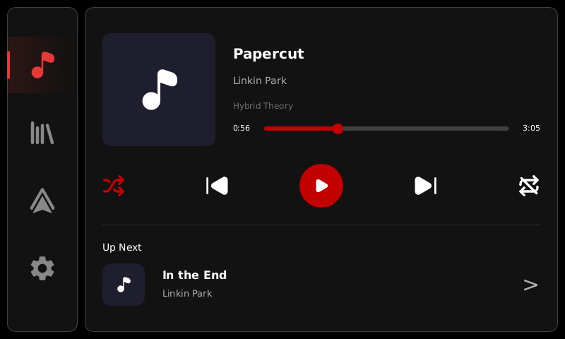
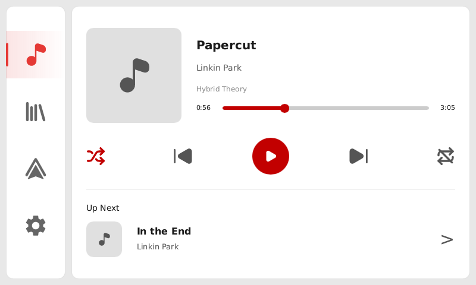
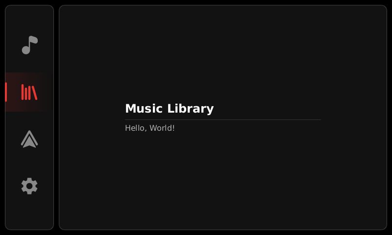
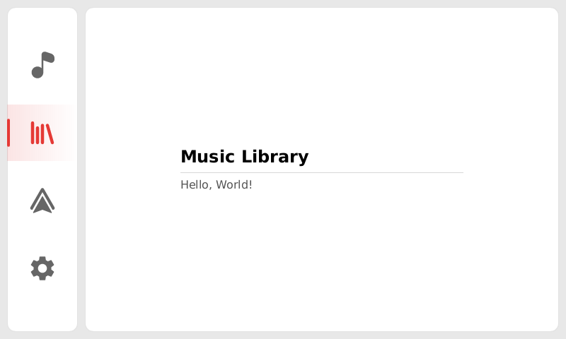
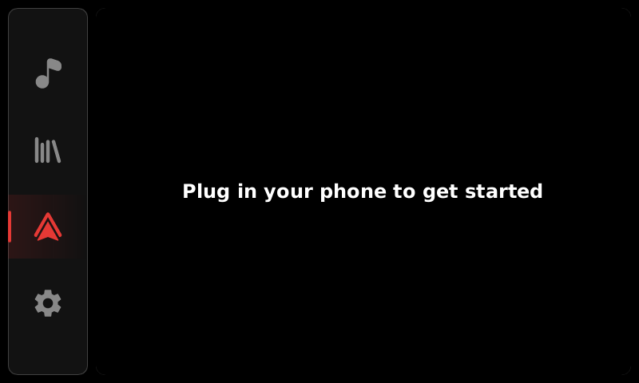
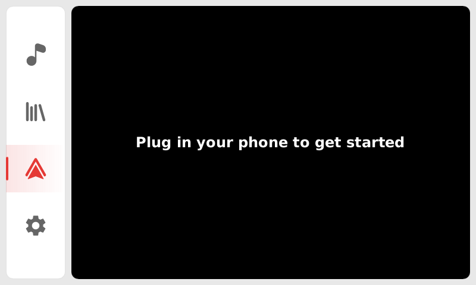
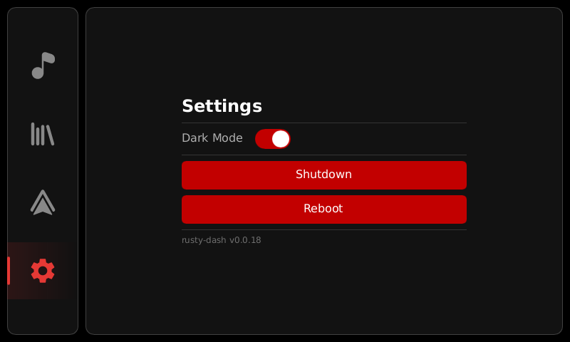
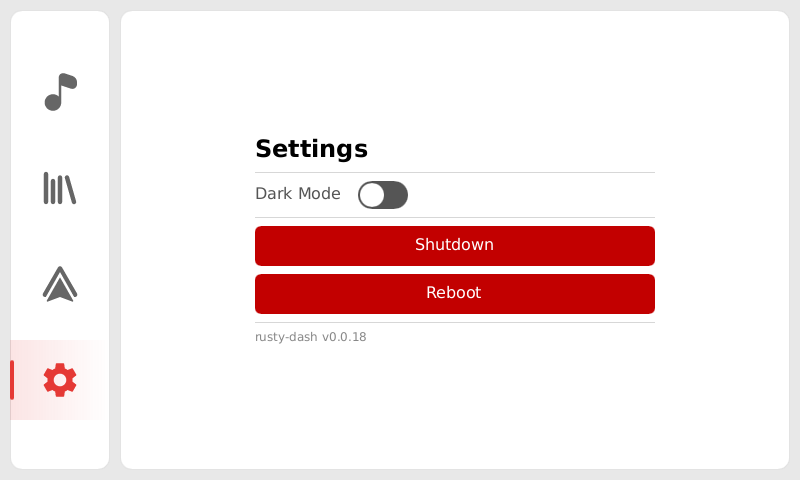

  <!--  -->
   
  <strong>Rusty Dash</strong>
    
  A full linux based headunit system for in my miata.
   
  I am running this on a pi3 with a 7 inch touchscreen.

## Installation

1. Download the latest image from [the release page](https://github.com/AlexJonker/rusty-dash/releases/latest)
2. Flash the downloaded file with raspberry pi imager.

## Information

Root password is `root`

User is called `driver` and password is `driver`

## Screenshots

Music

  
  

Music Library

  
  

Android Auto

  
  

Settings

  
  

