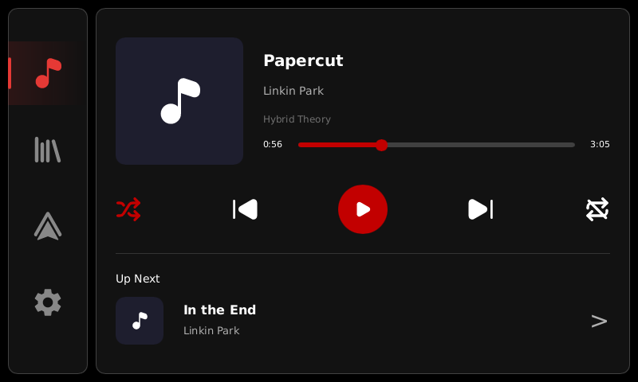
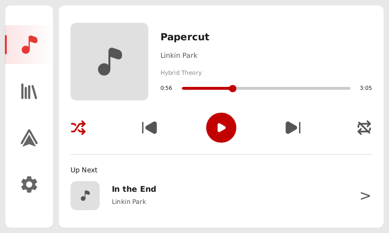
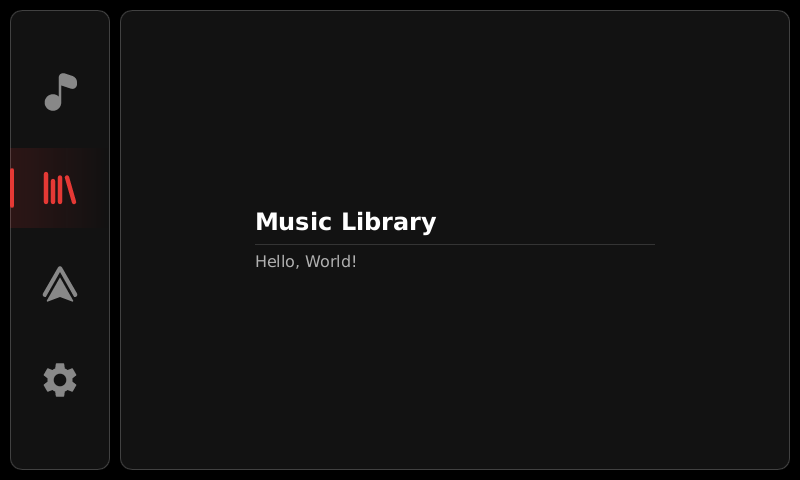
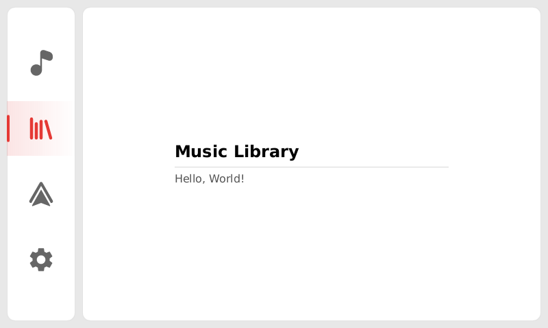
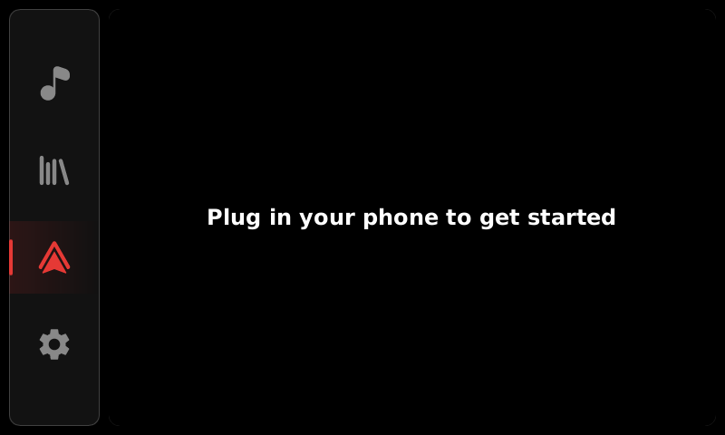
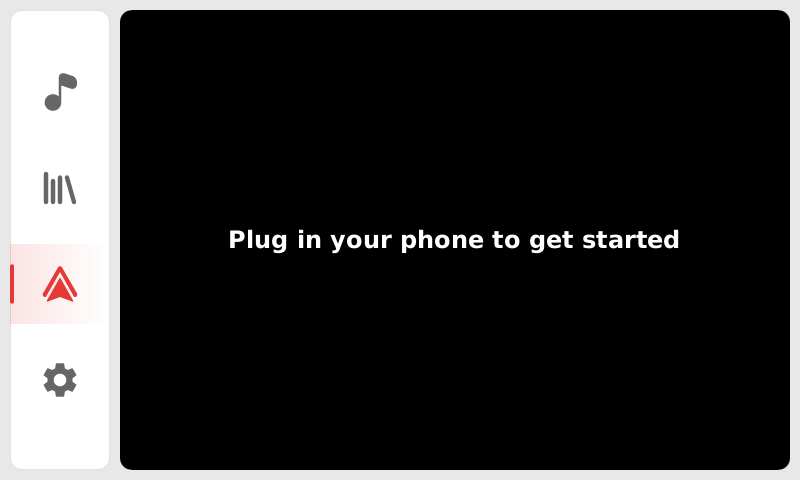
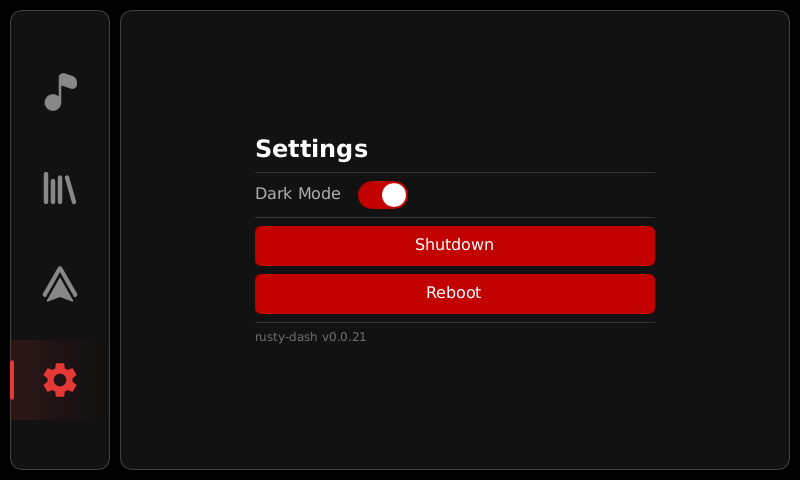
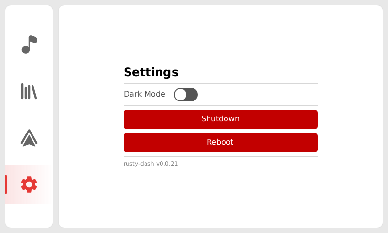

  <!--  -->
   
  <strong>nowa</strong>
    
  A little computer for your little car.

## Installation

1. Download the latest image from [the release page](https://github.com/nowa-dash/nowa/releases/latest)
2. Flash the downloaded file with raspberry pi imager.

## Information

Root password is `root`

User is called `alarm` and password is `alarm`

<!-- ## Screenshots

Music

  
  

Music Library

  
  

Android Auto

  
  

Settings

  
  

 -->
